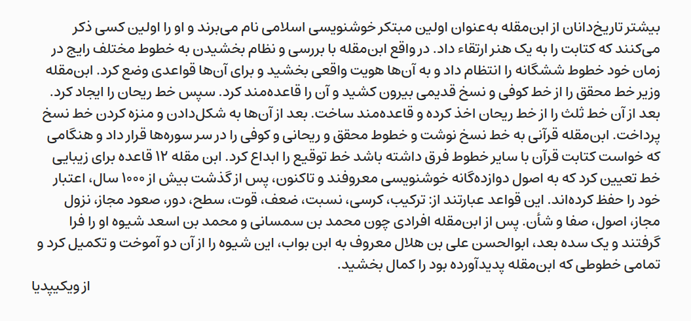
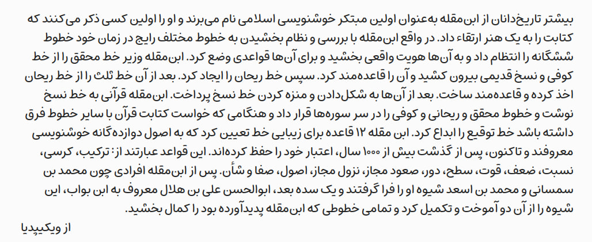
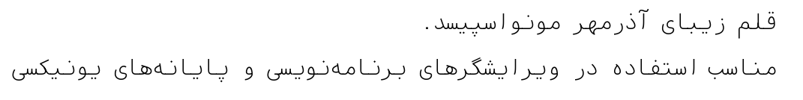

# راهنمای قلم‌های فارسی
معرفی قلم‌های آزاد فارسی: از اینجا می‌توانید قلم فارسی موردنیازتان را با پروانهٔ آزاد پیدا کنید.

# این مخزن
در این مخزن قلم‌های فارسی به‌تفکیک کاربرد خواهند آمد. اطلاعات هر قلم شامل اسم، تصویر نمونه، کاربرد آن، اطلاعات پیرامون قلم و پیوندهایی برای مراجعه به صفحهٔ اصلی قلم و بارگیری فایل آن هستند.

# دسته‌بندی قلم‌ها

## نوشتن در وب
- [قلم استعداد](https://aminabedi68.github.io/Estedad/) ساختهٔ امین عابدی

## چاپ کتاب

- [قلم ساحل](https://rastikerdar.github.io/sahel-font/)، ساختهٔ صابر راستی‌کردار
  

## طراحی گرافیکی
 - [قلم میخک](https://aminabedi68.github.io/Mikhak/) ساختهٔ امین عابدی که برای ساخت کامیک هم مناسب است.
 

## برنامه‌نویسی

- قلم [آذرمهر مونو](https://github.com/aminabedi68/AzarMehrMonospaced). ساختهٔ امین عابدی. قلم تک‌فاصله مناسب برنامه‌نویسی.
  
