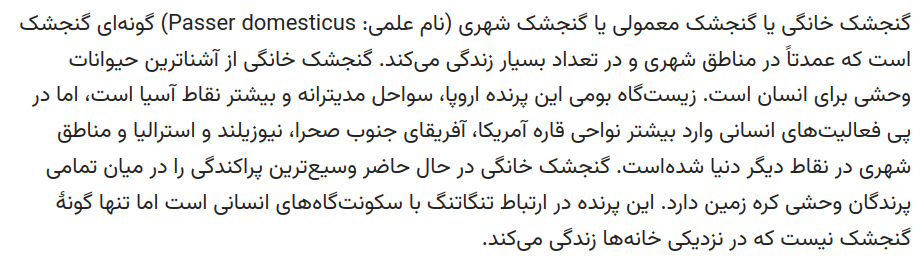
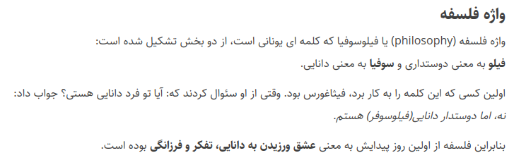

# راهنمای قلم‌های فارسی
معرفی قلم‌های آزاد فارسی: از اینجا می‌توانید قلم فارسی موردنیازتان را با پروانهٔ آزاد پیدا کنید.

# این مخزن
در این مخزن قلم‌های فارسی به‌تفکیک کاربرد خواهند آمد. اطلاعات هر قلم شامل اسم، تصویر نمونه، کاربرد آن، اطلاعات پیرامون قلم و پیوندهایی برای مراجعه به صفحهٔ اصلی قلم و بارگیری فایل آن هستند.

# دسته‌بندی قلم‌ها

## نوشتن در وب
- [قلم استعداد](https://aminabedi68.github.io/Estedad/) ساختهٔ امین عابدی

- [قلم وزیرمتن](https://rastikerdar.github.io/vazirmatn/fa)، ساختهٔ صابر راستی‌کردار
  
- [قلم آراد](https://github.com/MDarvishi5124/Arad) ساختهٔ محمد درویشی که یک قلم هندسی است.

## چاپ کتاب

- [قلم ساحل](https://rastikerdar.github.io/sahel-font/)، ساختهٔ صابر راستی‌کردار
  

## طراحی گرافیکی
 - [قلم میخک](https://aminabedi68.github.io/Mikhak/) ساختهٔ امین عابدی که برای ساخت کامیک هم مناسب است.
 
- [قلم سورنا](https://github.com/MDarvishi5124/Sorena) ساختهٔ محمد درویشی. یک قلم پیکسلی مناسب استفاده در هنر پیکسلی در بازی‌های ویدیویی و تابلوهای هنری است.
- [قلم یونیکسل](https://github.com/MDarvishi5124/Unixel) ساختهٔ محمد درویشی. یک قلم پیکسلی است که با الهام از خوشنویسی عربی ساخته شده.

## برنامه‌نویسی

- قلم [آذرمهر مونو](https://github.com/aminabedi68/AzarMehrMonospaced). ساختهٔ امین عابدی. قلم تک‌فاصله مناسب برنامه‌نویسی.
  
